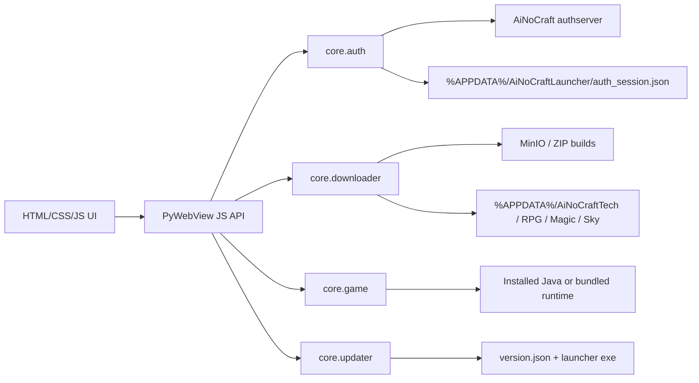

# AiNoCraft Launcher

<p align="center">
  
</p>

<p align="center">
  
</p>

<p align="center">
  
  
  
  
  
</p>

<p align="center">
  Windows-ориентированный desktop launcher для AiNoCraft: логин через Yggdrasil-compatible auth server, скачивание сборок, self-update и запуск Minecraft из одного окна.
</p>

## Обзор

AiNoCraft Launcher - это десктопный лаунчер проекта AiNoCraft на Python + PyWebView. Он использует встроенный HTML/CSS/JS интерфейс, а Python-слой отвечает за авторизацию, хранение сессии, скачивание игровых сборок, проверку обновлений лаунчера и запуск Minecraft c `authlib-injector`.

Проект рассчитан в первую очередь на Windows: использует `edgechromium` в `pywebview`, хранит чувствительные токены через Windows DPAPI и запускает игру через `javaw.exe`.

## Что умеет лаунчер

- Показывать нативное desktop-окно с web-интерфейсом на `pywebview`.
- Выполнять логин через `/minecraft-server-api/authserver/authenticate`.
- Сохранять access/refresh session локально и восстанавливать её между перезапусками.
- Шифровать чувствительные данные сессии через Windows DPAPI.
- Поддерживать несколько игровых сборок из `build_profiles.json`.
- Скачивать ZIP-сборки, отслеживать прогресс и распаковывать их в отдельные instance-папки.
- Автоматически подбирать подходящую Java runtime по требованиям Minecraft version JSON.
- Запускать Minecraft с `authlib-injector` и токенами пользователя.
- Проверять новую версию лаунчера и выполнять self-update в собранной `.exe` версии.
- Открывать разрешённые внешние ссылки на регистрацию и сброс пароля.

## Архитектура



## Основные возможности по слоям

| Слой | Что делает |
| --- | --- |
| `launcher.py` | точка входа, создание окна, crash log, startup cleanup |
| `ui/api.py` | bridge между JavaScript и Python |
| `core/auth.py` | login, refresh, validate, logout, локальное сохранение сессии |
| `core/downloader.py` | скачивание ZIP, прогресс, cancel, распаковка |
| `core/game.py` | сборка JVM-команды, authlib-injector, запуск Java-процесса |
| `core/java.py` | определение доступной Java и её major version |
| `core/updater.py` | проверка `version.json`, скачивание новой `.exe`, замена бинаря |
| `config/profiles.py` | список сборок, runtime config и разрешение путей |

## Текущие сборки

Список сборок загружается из `build_profiles.json`.

| ID | Имя | Версия | Источник |
| --- | --- | --- | --- |
| `tech` | `AiNoCraftTech` | `Tech` | `https://storage.ainocraft.com/downloads/AiNoCraftTech.zip` |
| `rpg` | `AiNoCraftRPG` | `RPG` | `https://storage.ainocraft.com/downloads/AiNoCraftRPG.zip` |
| `magic` | `AiNoCraftMagic` | `Magic` | `https://storage.ainocraft.com/downloads/AiNoCraftMagic.zip` |
| `sky` | `AiNoCraftSky` | `Sky` | `https://storage.ainocraft.com/downloads/AiNoCraftSky.zip` |

Каждая сборка ставится в отдельную директорию вида `%APPDATA%\AiNoCraftTech` и имеет собственный `launcher_settings.json`.

## Быстрый старт

### Вариант 1. Запуск из исходников

1. Установите Python `3.11`.
2. Установите зависимости любым удобным способом.

Через PDM:

```bash
pdm install
```

Или напрямую через `pip`:

```bash
python -m pip install pywebview requests pyinstaller
```

3. Запустите лаунчер:

```bash
python launcher.py
```

> При запуске из исходников self-update отключён специально, чтобы не повредить `launcher.py` или рабочую директорию разработчика.

### Вариант 2. Переключение auth-сервера

Лаунчер поддерживает профили `prod` и `local`.

PowerShell:

```powershell
$env:AINOCRAFT_AUTH_PROFILE="local"
python launcher.py
```

```powershell
$env:AINOCRAFT_AUTH_PROFILE="prod"
python launcher.py
```

cmd.exe:

```bat
set AINOCRAFT_AUTH_PROFILE=local && python launcher.py
```

```bat
set AINOCRAFT_AUTH_PROFILE=prod && python launcher.py
```

Можно переопределить базовый URL напрямую:

```powershell
$env:AINOCRAFT_AUTH_BASE_URL="https://your-domain.tld"
python launcher.py
```

### Вариант 3. Сборка `.exe`

Версия читается из `version.json`, а packaging идёт через `launcher.spec`.

```bash
python _build_helper.py build_exe
```

После сборки PyInstaller формирует desktop-бинарь, для которого уже доступен self-update.

## Как работает self-update

| Шаг | Что происходит |
| --- | --- |
| 1 | лаунчер проверяет `https://storage.ainocraft.com/downloads/version.json` |
| 2 | если remote version новее локальной, начинается скачивание новой `.exe` |
| 3 | файл валидируется по размеру, PE-заголовку и опционально по `sha256` |
| 4 | detached PowerShell helper ждёт завершения процесса лаунчера |
| 5 | старый бинарь заменяется новой версией и лаунчер запускается снова |

Self-update работает только для собранного `.exe` и намеренно отключён при source-run.

## Переменные окружения

| Переменная | Назначение | Значение по умолчанию |
| --- | --- | --- |
| `AINOCRAFT_AUTH_PROFILE` | выбор профиля auth-сервера | `prod` |
| `AINOCRAFT_AUTH_BASE_URL` | прямое переопределение base URL auth/API | зависит от профиля |
| `AINOCRAFT_AUTHLIB_INJECTOR_JAR` | путь к `authlib-injector` jar | авто-поиск |
| `AINOCRAFT_BUILD_PROFILES` | путь к кастомному `build_profiles.json` | не задан |

Профили auth-сервера в текущем коде:

| Профиль | Base URL |
| --- | --- |
| `prod` | `https://api.ainocraft.com` |
| `local` | `http://127.0.0.1:8000` |

## Поиск `authlib-injector` jar

Лаунчер ищет `authlib-injector-1.2.7.jar` в таком порядке:

1. путь из `AINOCRAFT_AUTHLIB_INJECTOR_JAR`;
2. `%APPDATA%\AiNoCraftLauncher\injector\authlib-injector-1.2.7.jar`;
3. `<launcher_dir>\authlib-injector-1.2.7.jar`;
4. `<launcher_dir>\injector\authlib-injector-1.2.7.jar`.

Пример для PowerShell:

```powershell
$env:AINOCRAFT_AUTHLIB_INJECTOR_JAR="F:\path\authlib-injector.jar"
python launcher.py
```

## Где лаунчер хранит данные

| Данные | Путь |
| --- | --- |
| crash log | `%APPDATA%\AiNoCraftLauncher\launcher_crash.log` |
| auth session | `%APPDATA%\AiNoCraftLauncher\auth_session.json` |
| fallback build profiles | `%APPDATA%\AiNoCraftLauncher\build_profiles.json` |
| persistent injector copy | `%APPDATA%\AiNoCraftLauncher\injector\...` |
| временные ZIP-файлы | `%TEMP%\AiNoCraftLauncher` |
| игровые инстансы | `%APPDATA%\AiNoCraftTech`, `%APPDATA%\AiNoCraftRPG` и т.д. |

`build_profiles.json` резолвится в таком порядке:

1. путь из `AINOCRAFT_BUILD_PROFILES`;
2. локальный файл в корне проекта;
3. fallback в `%APPDATA%\AiNoCraftLauncher\build_profiles.json`.

## Как выглядит auth flow

| Этап | Что делает лаунчер |
| --- | --- |
| Login | отправляет логин/пароль на `/authenticate` |
| Session restore | использует `/refresh`, чтобы не просить логин каждый запуск |
| Validate | проверяет access token через `/validate` |
| Logout | инвалидирует сессию через `/invalidate` |
| Launch | передаёт user/token/profile в Java-процесс |

Ссылки из UI открываются только на заранее разрешённые адреса:

- `https://ainocraft.com/register`
- `https://ainocraft.com/reset-password`

## Структура проекта

```text
launcher.py              # desktop entrypoint и инициализация окна
_build_helper.py         # сборка exe через PyInstaller
launcher.spec            # packaging-спецификация
version.json             # текущая версия и URL обновления
build_profiles.json      # список игровых сборок и download URL
config/                  # константы, пути, build profiles
core/                    # auth, downloader, game, java, updater, settings
ui/api.py                # bridge для pywebview
ui/web/                  # HTML/CSS/JS интерфейс
ui/img/                  # логотип и фон лаунчера
injector/                # authlib-injector jar
```

## Полезные команды

```bash
python launcher.py
python _build_helper.py build_exe
```

## Связанные части проекта

- `AiNoCraft_back` - authserver, игровые endpoint'ы и storage/backend API.
- `AiNoCraft_front` - сайт, личный кабинет, новости и витрина лаунчера.
- `AiNoCraft_dep` - reverse proxy и production-инфраструктура для доменов проекта.